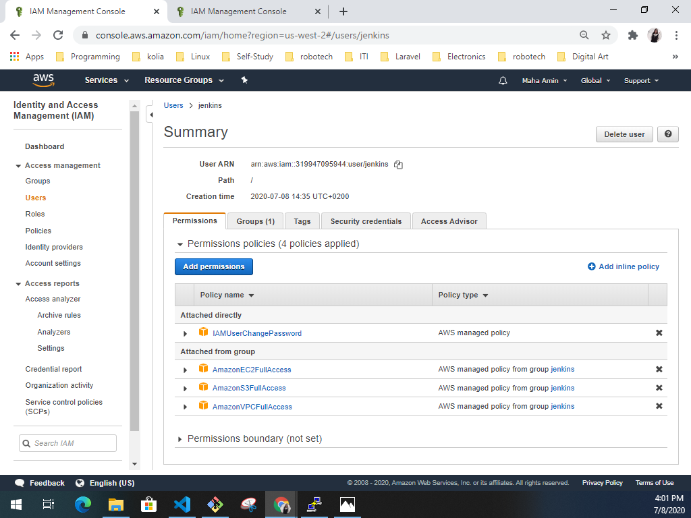
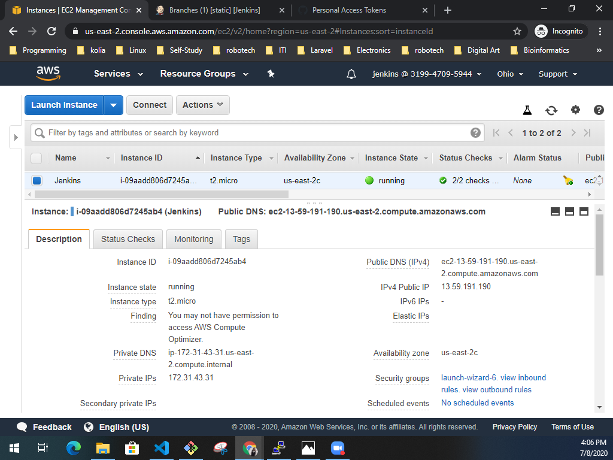
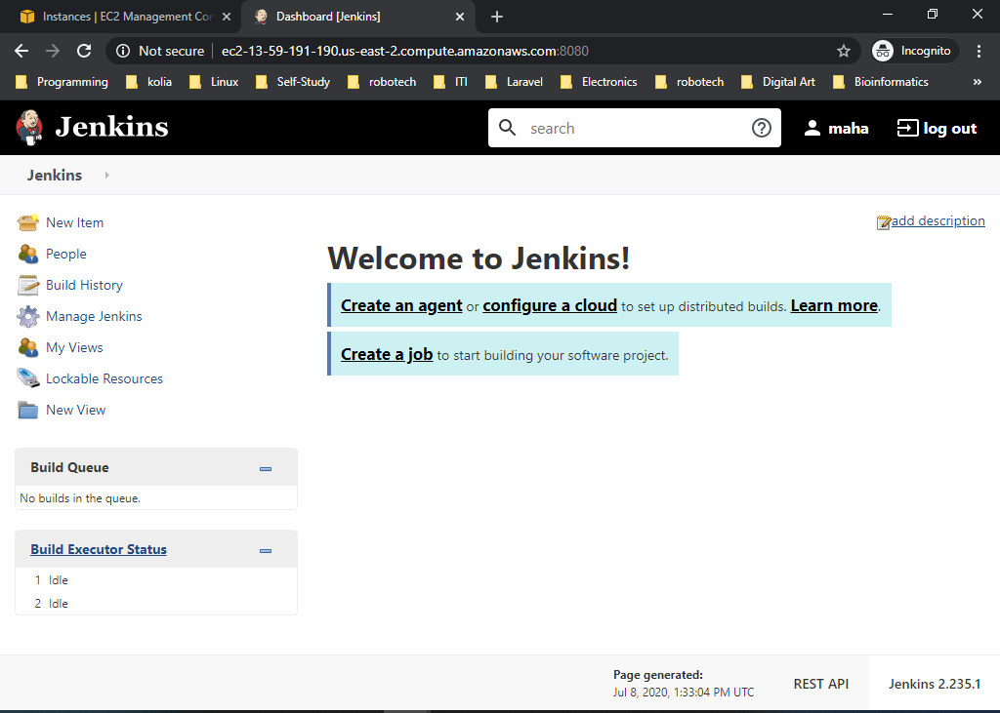
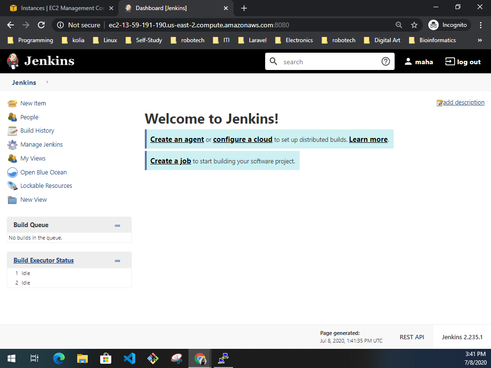
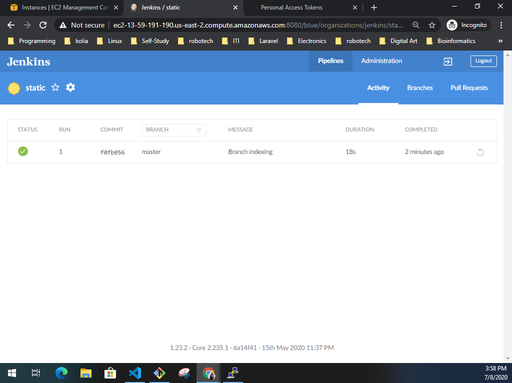
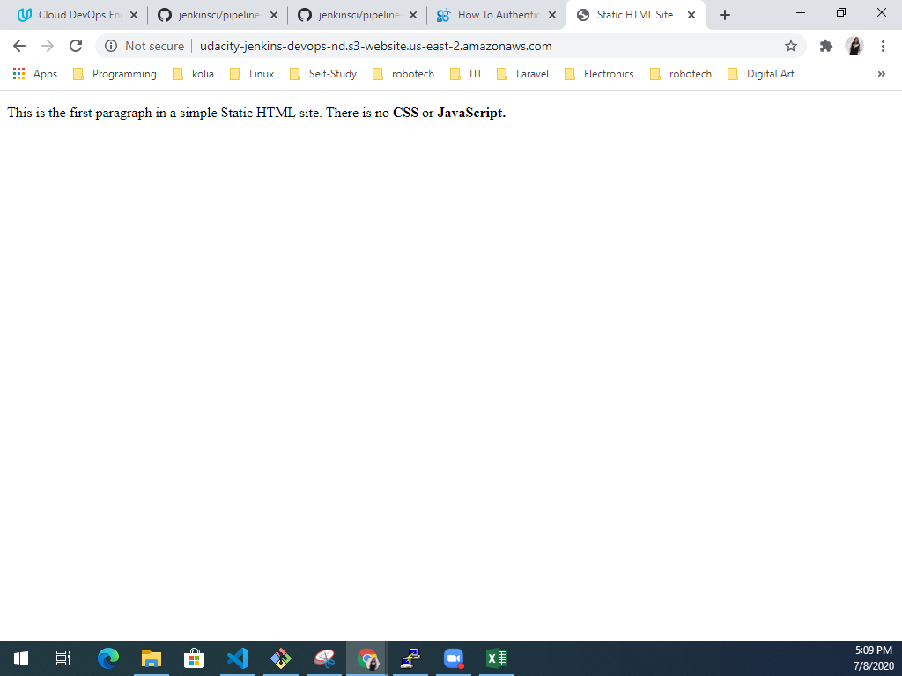
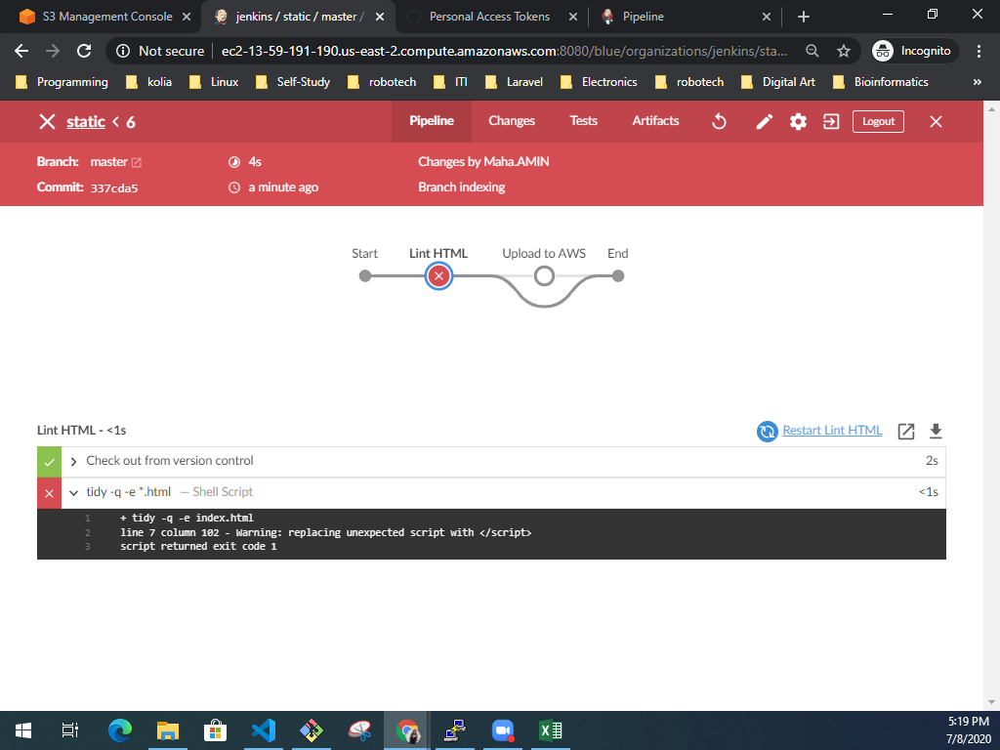
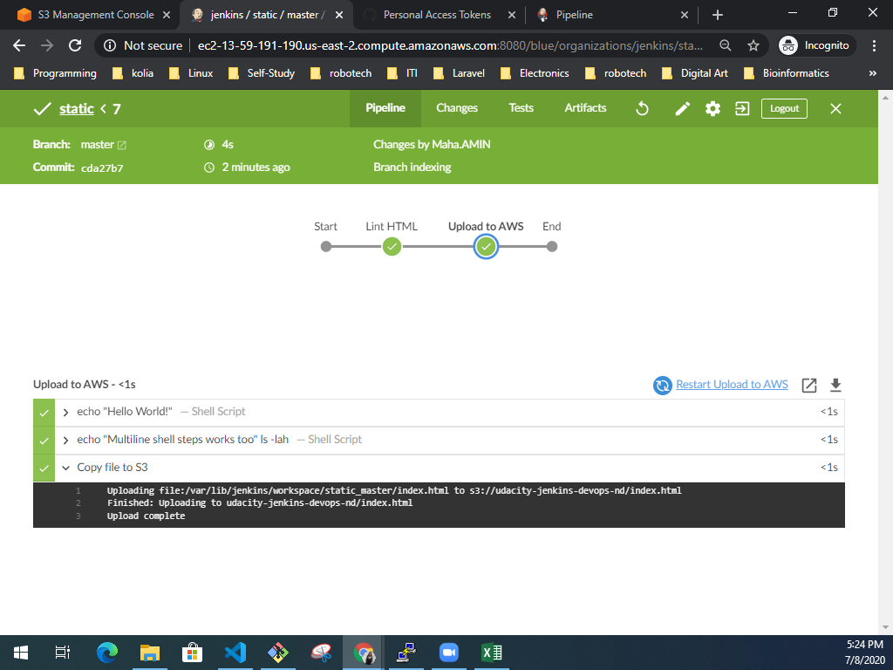

# AWS Jenkins Pipeline CI/CD

## Description
This project aims to create and run an instance on AWS, configure Jenkins, and create a pipeline to deploy a static website on S3.

## Steps:

### 1. AWS Setup:

- Create an IAM group "jenkins", and attach the following polices:
    - AmazonEC2FullAccess
    - AmazonVPCFullAccess
    - AmazonS3FullAccess

- Create an IAM user "jenkins" and add it to "jenkins" group.

- Launch an EC2 t2.micro "Ubuntu 18.04 LTS amd64".

- Install jenkins server on the instance.

### 2. Jenkins Setup:

- Install Blue Ocean Plugin:

- Create new jenkins-pipeline:
    - [Jenkinsfile](Jenkinsfile)
    - Create new pipeline on jenkins server:

- Set up AWS credentials in Jenkins.

- Set up S3 Bucket with public access.

- Configure the S3 bucket to host static website.

### Pipeline Stages:

- Add the following stages to Jenkinsfile:
    - "Lint HTML" to lint index.html file using tidy package.

    - "Upload to AWS" to upload the files of the static website to the S3 bucket.

- Fix the errors produced from the linting stage.

