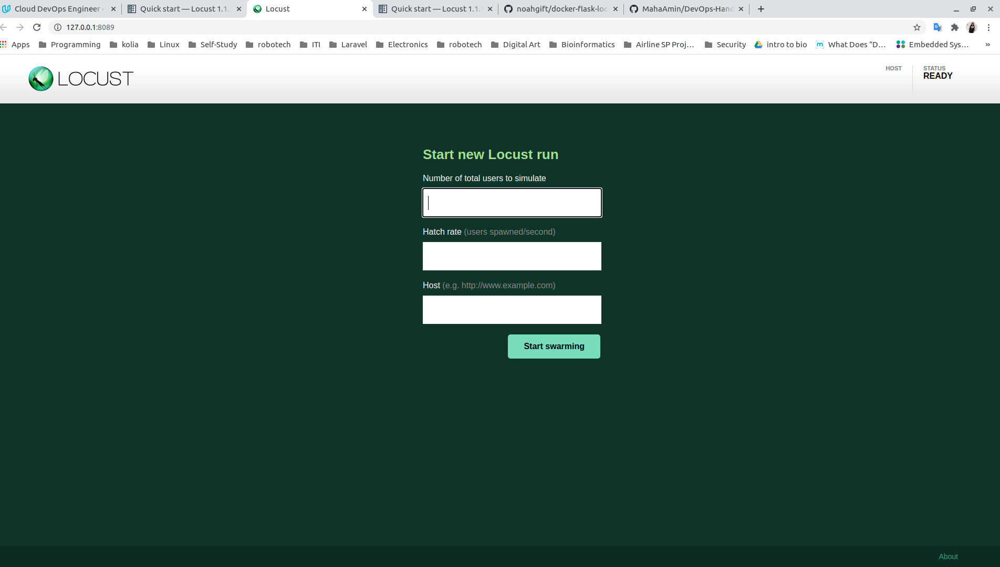
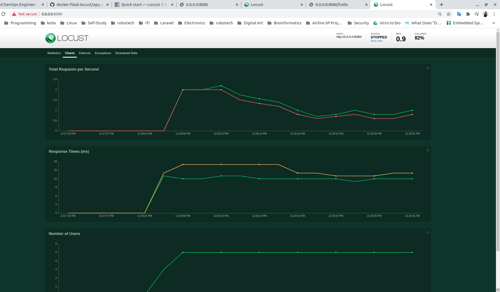

# Getting Started With Locust Load Test

## Table of Content:
1. [Installation](#installation)
2. [Flask Application](#flask-application)
3. [Run The Application](#run-the-application)


<hr>

## Installation:

- Create virtual environment:
    ```
    python3 -m venv venv
    ```

    ```
    source venv/bin/activate
    ``` 
    
- Locust is available on PyPI and can be installed with pip:

    ```
    pip3 install locust
    ```

- To install all required modules in requirments.txt:

    ```
    pip install -r requirements.txt
    ```


<hr>

## Flask Application:

- This is the architecture of a simple web-app using flask python framework:

    - app.py --> main application.
    - locusfile.py --> locus tests module.


<hr>


## Run The Application:

- To run the app.py, open a a terminal:

    ```
    python3 app.py
    ```

    - open http://localhost:8080 in a web browser.

- To run the load test with locus, open another terminal (where the locusfile exists):

    ```
    locus
    ```

    - open http://localhost:8089 in a web browser.




- A simple test can be:
    - 5 users
    - Add 1 user per second
    - The web app runs on http://localhost:8080


    

    


