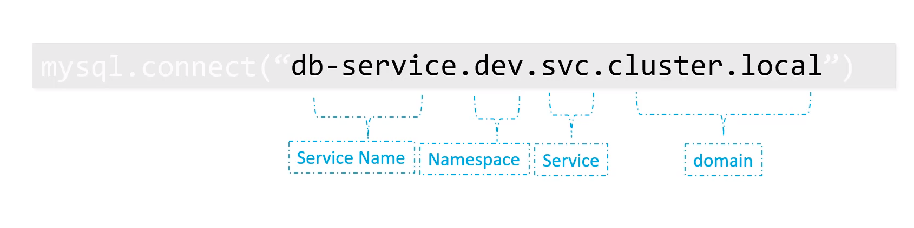

# CKA: Certified Kuberntes Administrator

## Table of Content:

1. [Core Concepts](#core-concepts)
    1. [Cluster Architecture](#cluster-architecture)
    2. [Namespaces](#namespaces)
2. [Scheduling](#scheduling)
    1. [Labels And Selectors](#labels-and-selectors)
    2. [Resource Limits](#resource-limits)
    3. [Manual Scheduling](#manual-scheduling)
    4. [Daemon Sets](#daemon-sets)
    5. [Static Pods](#static-pods)
    5. [Multiple Schedulers](#multiple-schedulers)
    6. [Scheduler Events](#scheduler-events)
    7. [Configure Kubernetes Scheduler](#configure-kubernetes-scheduler)
3. [Logging Monitoring](#logging-monitoring)
    1. [Monitor Cluster Components](#monitor-cluster-components)
    2. [Monitor Applications](#monitor-applications)
    3. [Monitor Cluster Component Logs](#monitor-cluster-component-logs)
    4. [Application Logs](#application-logs)
4. [Application Life Cycle](#application-life-cycle)
    1. [Rolling Updates And Rollbacks In Deploy](#rolling-updates-and-rollbacks-in-deploy)
    2. [Configure Applications](#configure-applications)
    3. [Scale Applications](#scale-applications)
    4. [Self-Healing Applications](#self-healing-applications)
5. [Cluster Maintenance](#cluster-maintenance)
    1. [Cluster Upgrade Process](#cluster-upgrade-process)
    2. [Operating System Upgrades](#operating-system-upgrades)
    3. [Backup And Restore Methodologies](#backup-and-restore-methodologies)
6. [Security](#security)
    1. [Authentication And Authorization](authentication-and-authorization)
    2. [Kubernetes Security](#kubernetes-security)
    3. [Images Securely](#images-securely)
    4. [Network Polices](#network-polices)
    5. [TLS Certificates For Cluster Components](#tls-certificates-for-cluster-components)
    6. [Security Contexts](#security-contexts)
    7. [Secure Persistance Value Store](#secure-persistance-value-store)
7. [Storage](#storage)
    1. [Persistent Volumes](#persistent-volumes)
    2. [Persistent Volume Claims](#persistent-volume-claims)
    3. [Configure Applications With Persistent Storage](#configure-applications-with-persistent-storage)
    4. [Access Models For Volumes](#access-models-for-volumes)
    5. [Kubernetes Storage Object](#kubernetes-storage-object)
8. [Networking](#networking)
    1. [Prerequisites](#prerequisites)
    2. [Networking Configuration on Cluster Nodes](#networking-configuration-on-cluster-nodes)
    3. [Service Networking](#service-networking)
    4. [POD Networking Concepts](#pod-networking-concepts)
    5. [Network Loadbalancer](#network-loadbalancer)
    6. [Ingress](#ingress)
    7. [Cluster DNS](#cluster-dns)
    8. [CNI](#cni)
9. [Installation Configuration Validation](#installation-configuration-validation)
    1. [Design a Kubernetes Cluster](#design-a-kubernetes-cluster)
    2. [Install Kubernetes Master and Nodes](#install-kubernetes-master-and-nodes)
    3. [Secure Cluster Communication](#secure-cluster-communication)
    4. [HA Kubernetes Cluster](#ha-kubernetes-cluster)
    5. [Provision Infrastructure](#provision-infrastructure)
    6. [Choose A Network Solution](#choose-a-network-solution)
    7. [Run And Analyze End-To-End Test](run-and-analyze-end-to-end-test)
    8. [Node End-To-End Tests](#node-end-to-end-tests)
10. [Troubleshooting](#troubleshooting)
    1. [Application Failure](#application-failure)
    2. [Worker Node Failure](#worker-node-failure)
    3. [Control Plane Failure](#control-plane-failure)
    4. [Networking](#networking)

11. [Commands](#commands)
12. [Notes](#notes)

<hr>


## Core Concepts

### Cluster Architecture

- Master Node:
    - ETCD Cluster.
    - Kupe API Server.
    - Kube Controller Manager.
    - Kube Scheduler.
    - Cloud Controller Manager.

- Worker Nodes:
    - Kubelet
    - Kube Proxy
    - Container Runtime Environment.


<hr>


**ETCD:**

- Distributed key-value store.
- ETCD listens to port 2379 by default.
- To set key-value pair:
    ```
    $ ./etcdctl set <key> <value>  
    ```

- To get tha value stored with a key:
    ```
    $ ./etcdctl get <key>
    ```

- ETCD in kubernetes:
    - Stores information about the cluster as: nodes, pods, configs, secrets, accounts, roles, bindings, ...etc.

    - All information from **kubectl get** are retrieved from etcd server.

    - Every change made on the cluster gets updated in the etcd.


<hr>


**Kube API Server:**

- Primary management component in kubernetes.
- KubeCtl talks to it.
- KubeCtl is not mandatory need, POST requests can be send directly to Kube-API.
- The only component that communicates with etcd.
- Kube API Server responsible for:
    - Authenticate User.
    - Validate Request.
    - Retrieve Data.
    - Update ETCD.
    - Scheduler.
    - Kubelet. 

<hr>


**Kube Controller Manager:**
- It manages several controllers in kubernetes.
- Kube controller manager contains many controllers:
    - Node controller:
        - It checks if the worker nodes are still up by reading heart-beats from worker them through kupe-api. If a node become unreachable for specific time it is marked as down and get replaced.
    - Replication controller:
        - It is responsible for checking the replicasets and the contained pods.
        - If a pod dies, it creates anotherone.
    - Deployment controller.
    - Namespace controller.
    - Endpoint controller.
    - CronJob.
    - Job controller.
    - PV-Protection controller.
    - Service account controller.
    - Stateful set.
    - Replicaset.
    - PV-Binder controller.

- When kube controller manager gets installed, all the sub-controllers get installed with it.

- The role of all these controllers:
    - Watch cluster status.
    - Take actions to keep the cluster in the desired state.


<hr>

**Kube Scheduler:**
- It decides which pod goes to which worker node.
- Filter nodes.
- Rank nodes.

<hr>

**Kubelet:**

- Register nodes.
- Create PODs.
- Monitor nodes and pods.

- Kubeadm does NOT automatically deploy kubelets, kubelets must be manually configured on each node.

<hr>


**Kube-Proxy:**

- Internal network to let nodes reach each other.

<hr>

### Namespaces

- There are 3 namespaces created automatically by kubernetes, at the cluster creation: 
    - "Default" namespace.

    - "kube-system" namespace: it contains kubernete's resources (ex: pods).

    - "kube-public" namespace, it is where resources will be available to all users.

- Namespaces are used for isolating the environments and set polices and resource quotas. (ex: dev, prod).

- DNS:
    - Resources in "default" NS, can be used without prefixes: db-service = db-service.dev.srv.cluster.local

    

<hr>

## Scheduling

### Labels And Selectors

- Select resources based on labels:
    ```
    kubectl get pods --selector env=prod,tier=frontend,bu=finance
    ```

<hr>

### Resource Limits

**Taints and Tolerations:**

- **Taint:** prevent pods from being deployed on a certain node. This is useful if a node has dedicated resources to certain tasks.

- To taint a node:
    ```
    kubectl taint nodes <node-name> <key>=<value>:<taint-effect>
    ```

- There are 3 options for the taint-effect:
    - NoSchedule: the pod will not be deployed on the node.
    - PreferNoSchedule: system will try not to deploy the pod on the node, but that is not guranted.
    - NoExecute: new pods 

- **Toleration:** give permission to a pod to be able to be deployed on a certain node.

- To add toleration to a pod: [pod-toleration](Kubernetes/cka-preparations/pod-toleration.yaml)


**Node Selectors:**

- Specify which node the pod will be deployed on.
- This is useful if we have a pod that executes heavy tasks, and needs high resources.

- To assign pod to a specific node, add nodeSelector attribute. [pod-node-selector.yaml](Kubernetes/cka-preparations/pod-node-selector.yaml)

- To label a node:
    ```
    kubectl label node <NodeName> <label-key>=<label-value>
    ```

**Node Affinity:**

- Add complex options more than nodeSelector.

[pod-node-affinity.yaml](Kubernetes/cka-preparations/pod-node-affinity.yaml)

[deployment-node-affinity.yaml](Kubernetes/cka-preparations/deployment-node-affinity.yaml)


**Resource Requirments and Limits:**

<hr>


### Daemon Sets

- Daemonsets are like replicasets, however it runs signle pod on every node.

- Use cases of a daemonset:
    - Monitoring.
    - Logging.
    - kube-proxy component is an example of daemonset usecases.

- Created by Kube-API server (DaemonS

et Controller)
- Ignored by the Kube-Scheduler.

<hr>

### Static Pods

- Pods created by the kubelet.
- Usecases: Deploy control plane (master node) components as static pod.
- Ignored by the Kube-Scheduler.

<hr>

### Multiple Schedulers


<hr>

## Security

- **PKI:** Public Key Infrastructure.

<hr>

## Design A Kubernetes Cluster

**When designing a kubernetes cluster, ask yourself these questions:**

- Purpose:
    - Education.
    - Development and Testing.
    - Hosting production Applications.

- Cloud or OnPrem?
- Workloads:
    - How many applications will be hosted on the cluster?
    - What kind of applications:
        - Web.
        - Big Data/Analytics?
    - Application Resource Requirements:
        - CPU Intesive.
        - Memory Intensive.
    - Traffic:
        - Heavy traffic.
        - Burst traffic.


**Choosing kubernetes infrastructure:**

- Kubernetes can be deployed on various platforms:
    - Local machine:
        - Minikube single node cluster. It configures the VMs by itself.
        - Kubeadm single or multiple node cluster. Expects the VMs are configured already.

    - Hosted (Managed) solutions:
        - Kubernetes-As-A-Service.
        - Provider provisions VMs.
        - Provider installs Kubernetes.
        - Provider maintains VMs.
        - Eg: Google Kubernetes Engine (GKE).
        - OpenShift Online.
        - Azure Kubernetes Service.
        - Amazon Elastic Container Service for kubernetes.

    - Turnkey Solutions:
        - You provision VMs.
        - You configure VMs.
        - You use scripts to deploy a cluster.
        - You maintain VMs yourself.
        - Eg: Kubernetes on AWS using KOPS.
        - Openshift
        - CloudFoundry Container Runtime
        - VMWare Cloud PKS.
        - Vagrant.


**ETCD In High Availability (HA):**
 - **Quorom:** minimum number of nodes that must be available for the cluster to function properly. (N/2+1)

 |Instances|Quorom|Fault Tolerance|
 |:-------:|:----:|:-------------:|
 |1|1|0|
 |2|2|0|
 |3|2|1|
 |4|3|1|
 |5|3|2|
 |6|4|2|
 |7|4|3|

 - It is recommended to use odd number larger than 2 of instances.

**Our Design:**
- 5 nodes:
    - 1 Loadbalancer node.
    - 2 Master nodes.
    - 2 Worker nodes.

- Stacked master design: etcd is in the same node as master node.

- We will create these nodes as VMs on **virtualbox** using **Vagrant**.

<hr>

### Commands:

- Add kubectl auto-completion script:
    ```
    source <(kubectl completion bash)
    ```

- Get resources of specific namespace:
    ```
    kubectl get pods --namespace=kube-system
    ```

- Create new namespace:
    ```
    kubectl create namespace <dev>
    ```

- Switch to a namespace:
    ```
    kubectl config set-context $(kubectl config current-context) --namespace=<dev>
    ```

- View resources in all namespaces:
    ```
    kubectl get pods --all-namespaces
    ```

- Send manual scheduling post request:
    ```
    curl --header "Content-Type:application/json" --request POST --data $(kubectl get pod nginx -o json) http://$SERVER/api/v1/namespaces/default/pods/$PODNAME/binding
    ```

- Select resources based on labels:
    ```
    kubectl get pods --selector env=prod,tier=frontend,bu=finance
    ```

- To taint a node:
    ```
    kubectl taint nodes <node-name> <key>=<value>:<taint-effect>
    ```

    ```
    kubectl taint nodes node1 app=blue:NoSchedule
    ```

- To label a node:
    ```
    kubectl label node <NodeName> <label-key>=<label-value>
    ```
    ```
    kubectl label node node01 size=Large
    ```

- Enable metrics-server for monitoring:
    ```
    minikube addons enable metrics-server
    ```

- Monitor resources consumption:
    ```
    kubectl top node
    ```
    ```
    kubectl top pod
    ```

- Run a command on a container pod:
    ```
    kubectl exec --stdin --tty <webapp> -- <command> <args>
    ```

    ```
    kubectl exec --stdin --tty webapp -- cat log/app.logs
    ```

### Notes:

- There are two ways to setup kubernetes:
    - Manual setup.
    - Using Kubeadm. 