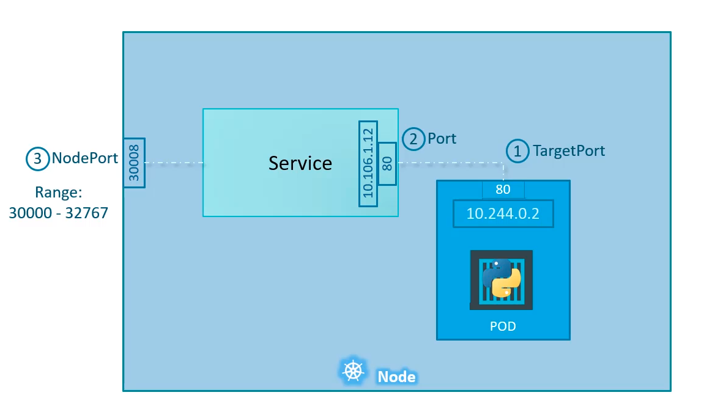

# Kubernetes

## Table of Content:

1. [Kubernetes For The Absolute Beginners](#kubernetes-for-the-absolute-beginners)
    1. [Kubernetes Overview](#kubernetes-overview)
    2. [Docker Containers](#docker-containers)
    3. [Containers Orchestration](#containers-orchestration)
    4. [Kubernetes Architecture](#kubernetes-architecture)
    5. [Kubernetes Setup](#kubernetes-setup)
    6. [Minikube](#minikube)
    7. [Kubernetes Concepts (PODs - ReplicaSets - Deployment)](#kubernetes-concepts)
    8. [Networking in Kubernetes](#networking-in-kubernetes)
    9. [Kubernetes Services](#kubernetes-services)
    10. [Microservices Architecture](#microservices-architecture)
    11. [KubeCtl](#kubectl)
    12. [YAML](#yaml)
    13. [YAML In Kubernetes](#yaml-in-kubernetes)
    14. [Kubernetes on Cloud](#kubernetes-on-cloud)
2. [Kubernetes Certificates](#kubernetes-certificates)
3. [Notes](#notes)
4. [Resources](#resources)


<hr>


## Kubernetes For The Absolute Beginners:

### Kubernetes Overview:

- Built by Google.
- It is now open source project.

<hr>


### Docker Containers:

- Refer to [Docker Study Book](Docker.md).

<hr>

### Containers Orchestration:

- Kubernetes is an orchestration technlogy.
- There are several other technologies for orchestration like: **Docker Swarm** and **MESOS** from apache.
- Kubernetes is now supported by all cloud providers.
- One of the most ranked os projects on GitHub.

<hr>


### Kubernetes Architecture:


- **Nodes (Minios):** is a machine physical or virtual.
- **Cluster:** set of nodes grouped together.
- **Master:** a node where kubernetes is installed, and configured as master. Responsible of the actual orchestration of containers in the worker nodes.
- **Container Runtime**: Docker engine.

<hr>


### Kubernetes Setup:

- There are Multi-node and Single-node setups.

- Options to install kubernetes:
    - Install kubernetes locally on your machine.
    - MicroK8s.
    - Minikube.
    - Kubeadm.
    - On cloud provider (AWS, GCP, Microsoft-Azure)

- Minikube:
    - Minikube executable.
    - Hypervisor (VirtualBox)
    - KubeCtl.

- Add kubectl auto-completion script:
    ```
    source <(kubectl completion bash)
    ```
    
<hr>


### Minikube:

- Start minikube:
    ```
    minikube start --driver=virtualbox
    ```

- Get minikube status:
    ```
    minikube status
    ```


<hr>

### Kubernetes Concepts:

- **PODs:**
    - Smallest object you can create on kubernetes.
    - One-to-one relationship with containers : each pod contains one container.
    - To scale up --> create new pods, not adding new containers to the same pod.
    - To scale down --> delete pods.
    - **Multi-Container PODS:**
        - A single pod can have multiple containers inside it.
        - Multiple containers but in **different types**.
        - They are called **Helper containers**. Containers that are highly assciociated with the main container in the pod.
        - Multiple containers are not intended for scaling, but rather for functionality.
        - Containers in the same pod shares the same network-space, and storage-space. 
        - They can communicate with eachother through "localhost", as they are in the same pod.
        - When scaling up all containers in the same pods get replicated, and in scaling down all containers die together.

    <hr>

- **Replication Controllers:**
    - Controllers are the brain behind kubernetes.
    - It is used in :
        - **High Availability**.
        - **Load Balancing**
        - **Scaling**
    - Replication controller spans across multiple nodes (machines) in the cluster.
    - Replication controller is the old version of **Replica Set**.

    - Define replication controller with .yaml file: [rc-definition.yaml](Kubernetes/kubernetes-for-beginners/replicasets/rc-definition.yaml)

    - To deploy the replication controller:
        ```
        kubectl create -f rc-definition.yaml
        ```
    <hr>

- **Replica Sets:**
    - The main difference between Replication-Controller and ReplicaSet is the **"selector"** tag.
    - The selector tag enables replicaset to manage pods that were not created by the replicaset, for example: pods that are existed before the creation of the replicaset.
    - The selector tag is **NOT** required.  

    - To scale the number of desired pods in the replicaset:
        - Change the value of replicas inside the replicaset.yaml file, then use kubectl to replace the old replicaset.

        - Use kubectl scale command:
            ```
            kubectl scale --replicas=6 -f replicaset.yaml
            ```

    - To delete a replicaset. **This will delete the replicaset and all underlying pods**:

    ```
    kubectl delete replicaset myapp-relicaset
    ```
    <hr>

- **Deployments:**

    - **Rollout:** Deploying new version of the application.
    - **Deploying Strategies:**
        - **Recreate Strategy:** 
            - Destroy all pods of older version, then create new pods with the newer version. 
            - This leads to application downtime.

        - **Rolling Update:** 
            - Delete and create pods one by one.
            - The default strategy in kubernetes.

    - The deployment yaml file is exactly the same as the replicaset yaml file except that the kind: Deployment.
    - Deployment automatically creates a replicaset.

<hr>

### Networking In Kubernetes 

- There is an IP assigned to the cluster.
- IPs are assigned to pods not containers.
- There are two modes of networking in kubernetes:
    - Single node kubernetes.
    - Kubernetes Cluster.
- Single node networking:
    - A sub-network is created with an IP.
    - All pods are part of this sub-network.
    - All pods can communicate with eachother without IP conflicts.

- Cluster Networking:
    - Each node in the cluster has unique IP.
    - Pods in different nodes can have the same IP, which can cause IP conflict in their communication.
    - Kubernetes expects that kubernetes admin should apply a solution that gurantees that:
        - All containers/pods can communicate to one another without NAT.
        - All nodes can communicate with all containers and vice-versa without NAT.
    - There are many solutions that can solve the required criteria, example: cisco, vmware NSX, flannel, cilium, ...etc. They manage IP addressing and routing techinques.

<hr>


### Kubernetes Services

- Services allows communication between several components,and between users and the application.

- Services allows loose coupling between microservices.

- Service is an object/resource just like pods and replicaset.
better
    - LoadBalancer

    <hr>

**NodePort:**

[nodeport.yaml](Kubernetes/kubernetes-for-beginners/services/nodeport-defenition.yaml)



- Basic example af accessing a webapp through nodePort:
    ```
    curl http://192.168.1.2:30008
    ```

- NodePort uses "Random Algorithm" to balance the load across pods by default.

- To print the url of the nodeport:
    ```
    minikube service myapp-nodeport --url
    ```
    <hr>

**ClusterIP:**

- ClusterIP service is used to group pods based on labels, and asssigns an IP to communicate with them.

- [clusterip.yaml](Kubernetes/kubernetes-for-beginners/services/clusterip-defenition.yaml)


 <hr> 

 **LoadBalancer:**
 

 <hr>

 ### Microservices Architecture


 <hr>

### KubeCtl

- Kubernetes Command-line tool.
- Kube-Control.
- Kube C T L.
- Used to deploy and manage applications in kubernetes cluster.
- Get cluster's information.

- Start minikube:
    ```
    minikube start --driver=virtualbox
    ```

- Get all objects:
    ```
    kubectl get all
    ```

- Deploy an application on the cluster:
    ```
    kubectl run hello-minikube
    ```

- Get information about the cluster:
    ```
    kubectl cluster-info
    ```

- List nodes in a cluster:
    ```
    kubectl get nodes
    ```

- Get more info about the nodes:
    ```
    kubectl get nodes -o wide
    ```

- Deploy a pod from image in DockerHub:
    ```
    kubectl run nginx --image nginx
    ```

- To create the pod from .yml file:
    ```
    kubectl create -f my-file.yml
    ```

- List existing pods:
    ```
    kubectl get pods
    ```

    ```
    kubectl get pods -o wide
    ```

- Get more information about specific pod:
    ```
    kubectl describe pod nginx
    ```

- To deploy the replication controller:
    ```
    kubectl create -f rc-definition.yaml
    ```

- To show all replication controllers:
    ```
    kubectl get replicationcontroller
    ```

- To show all replicasets:
    ```
    kubectl get replicaset
    ```

- To edit a replicaset:
    ```
    kubectl replace -f replicaset-defenition.yaml
    ```

- To scale (change the number of desired pods) a replicaset:
    ```
    kubectl scale --replicas=6 -f replicaset.yaml
    ```

    ```
    kubectl scale --replicas=<number-of-desired-pods> <type> <name>
    ```

    ```
    kubectl scale --replicas=5 replicaset myapp-replicaset
    ```

- To delete an object:
    ```
    kubectl delete <type> <name>
    ```

    ```
    kubectl delete replicaset myapp-relicaset
    ```

- To edit a resource:
    ```
    kubectl edit <type> <name>
    ```

    ```
    kubectl edit replicaset myapp-replicaset
    ```

- Rolling update (apply updates) to deployment:
    ```
    kubectl apply -f deployment.yaml
    ```

- Rollback a deployment:
    ```
    kubectl rollout undo deployment/myapp-deployment
    ```

- To print the url of the nodeport:
    ```
    minikube service myapp-nodeport --url
    ```

<hr>


### YAML:

- **YAML:** Yet Another Markup Language.
- Do NOT use tab, use 2 spaces and stick to it.
- Key-Value pair:
    ```
    Fruit: Apple
    Vegetable: Carrot
    Liquid: Water
    Meat: Chicken
    ```

- Array/List:
    ```
    Fruits:
    - Apple
    - Orange
    - Banana

    Vegetables:
    - Carrot
    - Tomato
    ```

- Dictinoray/Map:
    ```
    Banana:
      Calories: 105
      Fat: 0.4 g
      Carbs: 27 g

    Grapes:
      Calories: 62
      Fat: 0.3 g
      Carbs: 16 g
    ```

- Key Value/Dictionary/Lists:
    ```
    Fruits:
    - Banana:
        Calories: 105
        Fat: 0.4 g
        Carbs: 27 g

    - Grapes:
        Calories: 62
        Fat: 0.3 g
        Carbs: 16 g
    ```

- Dictionary --> unordered
- Lists --> ordered

<hr>


### YAML In Kubernetes:

- Basic template of kubernetes .yml file. These fileds are **required** :

    ```
    apiVersion:
    kind:
    metadata:


    spec:
    ```

- apiVersion: the version of kubernetes API we are using to create the object.

- Example: 

    ```
    apiVersion: v1
    kind: Pod
    metadata:
      name: myapp-pod
      labels:
        app: myapp
        type: front-end            
    spec:
      containers:
        - name: nginx-container
          image: nginx
    ```

- To create the pod from .yml file:
    ```
    kubectl create -f my-file.yml
    ```
<hr>


## Kubernetes Certificates:

- **CKA** : Certified Kubernetes Adminstrator.
- **CKAD**: Certified Kubernetes Application Developer


<hr>


## Notes:
- We use docker-compose for local environment, and kubernetes for production.


## Resources:

- [Kubernetes for the absolute beginners](https://www.udemy.com/course/learn-kubernetes/)